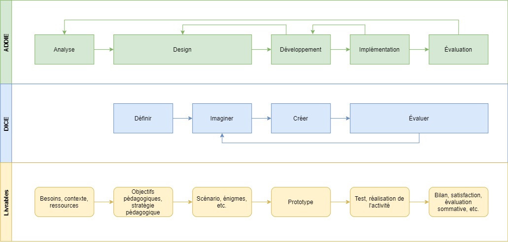

# Méthode ADDIE + D.I.C.E.

Cette fiche articule deux repères complémentaires :

- **ADDIE**, pour garder le cadre du design pédagogique global ;
- **D.I.C.E.**, pour concevoir le jeu sérieux lui-même.

Le point de départ n'est donc pas "quel jeu allons-nous faire ?", mais "quel apprentissage voulons-nous provoquer, auprès de quel public, dans quelles conditions, et comment saurons-nous que cela fonctionne ?".

## Objectifs de conception

La méthode doit permettre de :

- formuler un besoin pédagogique et des objectifs observables ;
- distinguer objectif pédagogique et objectif ludique ;
- transformer un apprentissage visé en actions de joueur ;
- choisir ou adapter des mécaniques utiles ;
- produire un prototype jouable, léger et testable ;
- évaluer la jouabilité et les apprentissages.

## Le double objectif

Un jeu sérieux pédagogique doit faire tenir ensemble deux objectifs :

- **objectif pédagogique** : ce que les apprenants doivent savoir, comprendre, appliquer, analyser, évaluer ou créer ;
- **objectif ludique** : ce que les joueurs cherchent à accomplir dans le jeu.

La question de conception centrale est :

> Pour réussir le jeu, que doit faire le joueur, et en quoi cette action l'aide-t-elle à apprendre ?

## ADDIE

ADDIE est un cadre général de design pédagogique : Analyse, Design, Développement, Implémentation, Évaluation. Il aide à ne pas commencer par l'idée de jeu, mais par le besoin, le public, les objectifs, les contraintes et les critères d'évaluation.

### Analyse

Identifier le public, les besoins, le contexte, les prérequis, les contraintes, les ressources disponibles et les critères de réussite.

Questions utiles :

- Qui apprend ?
- Que faut-il apprendre ?
- Pourquoi le jeu serait-il pertinent ?
- Quelles contraintes de temps, lieu, matériel, animation ?

### Design

Définir la stratégie pédagogique, les objectifs, les contenus, les modalités, le scénario d'apprentissage, les règles de feedback et l'évaluation.

### Développement

Produire les supports : plateau, cartes, narration, énigmes, interface, consignes, livret animateur, grille d'observation.

### Implémentation

Animer ou diffuser le jeu dans son contexte réel. Préparer l'entrée dans le cercle du jeu, les consignes, le rôle de l'animateur, les modalités d'aide et le débriefing.

### Évaluation

Mesurer l'apprentissage, l'engagement, la jouabilité, la qualité du feedback et les améliorations nécessaires.

## D.I.C.E.

D.I.C.E. est documenté dans le corpus du kit comme modèle générique de conception d'un serious game pédagogique : Définir, Imaginer, Créer, Évaluer.

Il sert ici de méthode opérationnelle : ADDIE garde le cap pédagogique global ; D.I.C.E. accompagne le passage vers un prototype jouable, testable et améliorable.

Sources internes : lexique de la ludification pédagogique ; atelier Trivial Pursuit. Repères complémentaires : Alvarez, Djaouti, Marne, Heidmann.

### Définir

Définir le contenu sérieux : besoin, public, contraintes, objectifs pédagogiques, contenus, critères d'évaluation.

Livrable : fiche de cadrage et objectifs pédagogiques formulés.

Vigilance : ne pas commencer par un jeu préféré.

### Imaginer

Imaginer le principe de jeu : objectif ludique, type de jeu, mécaniques, règles, scénario, feedbacks, traces.

Livrable : matrice objectifs-mécaniques-feedbacks-traces.

Vigilance : éviter les mécaniques décoratives.

### Créer

Créer un prototype jouable. Le prototype doit être assez complet pour tester la boucle principale, mais assez léger pour être corrigé rapidement.

Livrable : prototype, consignes, matériel, cartes ou scénario.

Vigilance : ne pas surproduire avant test.

### Évaluer

Tester le jeu auprès du public cible ou d'un groupe proche. Observer la compréhension des règles, les blocages, la qualité des feedbacks, l'atteinte des objectifs et les améliorations.

Livrable : retours d'observation, décisions d'itération et version suivante.

Vigilance : ne pas confondre plaisir de jeu et apprentissage réel.

## Schéma de synthèse

Le schéma se lit comme une correspondance : ADDIE cadre l'ingénierie pédagogique, D.I.C.E. traduit ce cadrage en étapes de conception du jeu et en livrables.

## Correspondance rapide

| ADDIE | D.I.C.E. | Livrable |
| --- | --- | --- |
| Analyse | Définir | fiche de cadrage : besoin, public, objectifs, contraintes |
| Design | Définir / Imaginer | matrice objectifs-mécaniques-feedbacks-traces |
| Développement | Créer | prototype : règles, cartes, plateau, scénario, consignes et matériel |
| Implémentation | Créer / Évaluer | animation testée : déroulé, médiation, aides et débriefing |
| Évaluation | Évaluer | observations, retours, critères d'apprentissage, itérations |
