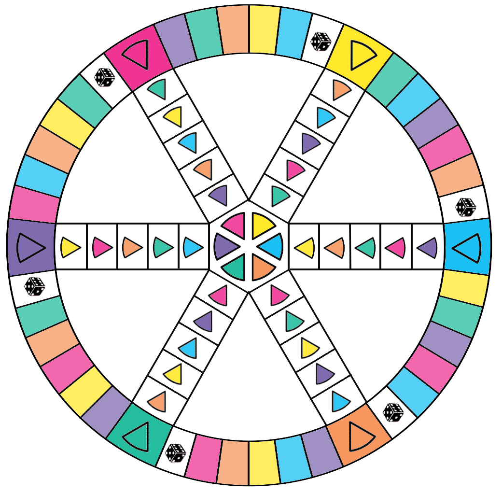

# Exemple : Trivial Pursuit pédagogique

## Type

Jeu de plateau dégamifié et adapté à des objectifs pédagogiques.

## Origine de l'exemple

Cet exemple reprend le cahier des charges d'un atelier pédagogique d'une demi-journée intitulé **Jouer avec ses méthodes d'enseignement : dégamifier pour motiver**.

Dans le kit autonome, il sert de cas guidé : on part d'un jeu connu, on analyse ses règles, puis on conserve, simplifie ou transforme ce qui permet de soutenir des apprentissages explicites.

## Contexte du cahier des charges

Le jeu à créer doit pouvoir être utilisable dans toute activité pédagogique visant à atteindre les objectifs pédagogiques cités dans le cahier des charges.

**Public cible :** toute personne ayant une mission d'enseignement, d'animation, de formation ou de conception pédagogique à Centrale Lille.

**Besoin :** favoriser l'engagement des étudiants par le recours au jeu d'apprentissage.

## Objectifs pédagogiques

À l'issue de l'activité utilisant le jeu, les participants devront être capables de :

1. Définir ce qu'est un jeu d'apprentissage et l'ensemble des notions corrélées, niveau 1 : mémoriser.
2. Associer des exemples d'utilisation de jeux d'apprentissage avec la typologie des jeux utilisés et les types d'objectifs pédagogiques qu'ils visent, niveau 2 : comprendre.
3. Décrire et appliquer les techniques de scénarisation, d'adaptation et de développement de jeux d'apprentissage dans un cadre d'enseignement, niveau 3 : appliquer.

## Description du jeu

### Choix du jeu

La création du jeu se fait par articulation entre dégamification et serious gaming.

Le jeu de base choisi, et à adapter aux contenus et aux objectifs pédagogiques, est le Trivial Pursuit.

Les raisons principales sont les suivantes :

- il répond aux trois niveaux d'apprentissage visés, avec des cases intermédiaires, des cases camembert et une progression finale ;
- les cases intermédiaires peuvent porter des questions de niveau 1, centrées sur la restitution de notions ;
- les cases camembert peuvent porter des questions de niveau 2, centrées sur la compréhension et l'association à des exemples ;
- la progression finale peut porter des questions de niveau 3, centrées sur l'application d'étapes ou de principes de conception ;
- il est relativement universel, bien connu et facile à modifier ;
- son succès montre qu'il a fait ses preuves en termes d'engagement des joueurs ;
- il est relativement simple à créer manuellement.

### Objectifs du jeu

Dans le jeu original, les joueurs cherchent à conserver autant que possible la main, à être les premiers à collectionner tous les camemberts, à se déplacer sur le plateau et à répondre aux questions.

Dans la variante pédagogique, les modalités pour jouer et gagner doivent rester des prétextes pour générer de l'apprentissage et favoriser l'engagement des participants.

## Structure des cartes

Les cartes peuvent être organisées en trois niveaux :

- niveau 1, mémoriser : définitions, vocabulaire, repères simples ;
- niveau 2, comprendre : reformulation, association à des exemples, comparaison de notions ;
- niveau 3, appliquer : choix d'une étape de conception, justification d'une mécanique, correction d'un problème d'alignement.

Chaque carte contient au minimum :

- une catégorie ;
- un niveau ;
- une question ;
- une réponse attendue ;
- un feedback exploitable en débriefing ;
- éventuellement une source, un indice ou une variante.

## Contraintes de mise en œuvre

- La partie doit tenir en 30 minutes maximum.
- Le prototype doit comporter au minimum 12 questions de niveau 1.
- Le prototype doit comporter au minimum 3 questions de niveau 2.
- Des questions de niveau 3 doivent permettre de travailler l'application des techniques de conception.
- Les règles doivent être simplifiées par rapport au jeu original.
- Les règles qui ralentissent la partie ou ne servent aucun apprentissage doivent être retirées.
- Les mécanismes ludiques ne doivent pas détourner les joueurs des objectifs pédagogiques.
- Les questions doivent pouvoir être corrigées sans ambiguïté.
- Une case correspond à une question tirée au hasard.
- Une carte correspond à une question et une réponse attendue.

## Déroulé de l'atelier source

| Moment | Étape | Actions |
| --- | --- | --- |
| 13h30-14h15 | Cadrage | Accueil, objectifs, notions clés, distinction entre jeu d'apprentissage, serious game, serious gaming et dégamification. |
| 14h20-14h45 | Définir | Présenter l'activité, le cahier des charges, les objectifs pédagogiques, les contraintes et les règles du Trivial Pursuit à analyser. |
| 14h45-15h30 | Imaginer | Trier les règles, écarter celles qui ne servent pas l'apprentissage, modifier les règles utiles et inventer les adaptations nécessaires. |
| 15h30-16h30 | Créer | Rédiger les cartes, dessiner ou adapter le plateau, répartir les tâches, fabriquer les supports et contrôler la cohérence du prototype. |
| 16h30-17h00 | Évaluer | Jouer une partie courte, observer les blocages, noter les améliorations et vérifier ce que le jeu fait réellement apprendre. |
| 17h00-17h30 | Consolider | Débriefer les apprentissages, les limites ludiques et pédagogiques, les points d'attention et les ajustements à prévoir. |

## Matériel minimal

- plateau ;
- cartes questions ;
- cartes règles ;
- dé ;
- pions ;
- jalons ou camemberts ;
- fiche de règles ;
- fiche animateur ;
- grille d'observation ;
- support de débriefing.

## Critères de test

Un prototype est prêt à être amélioré si :

- les règles sont comprises sans surcharge ;
- les questions sont alignées avec les objectifs pédagogiques ;
- les feedbacks aident réellement à comprendre ;
- la progression ludique reste lisible ;
- le jeu peut être débriefé ;
- les joueurs savent dire ce qu'ils ont appris, corrigé ou réinvesti.

## Points de vigilance

Le Trivial Pursuit pédagogique peut vite devenir un simple quiz décoré. Il faut donc vérifier que la construction des cartes, les feedbacks et le débriefing produisent autre chose qu'une succession de bonnes ou mauvaises réponses.

Le prototype gagne en intérêt lorsqu'il demande aux joueurs d'expliquer, d'associer, de justifier ou de corriger, et pas seulement de reconnaître une définition.
